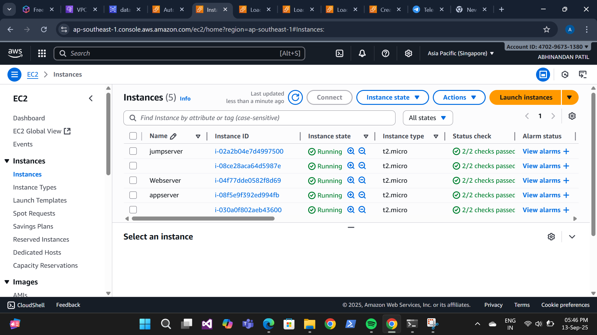
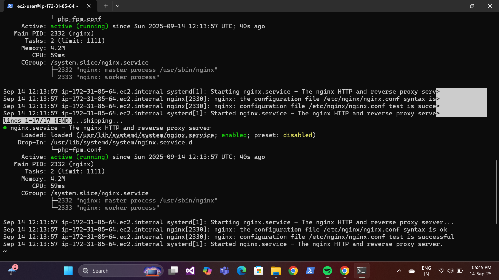
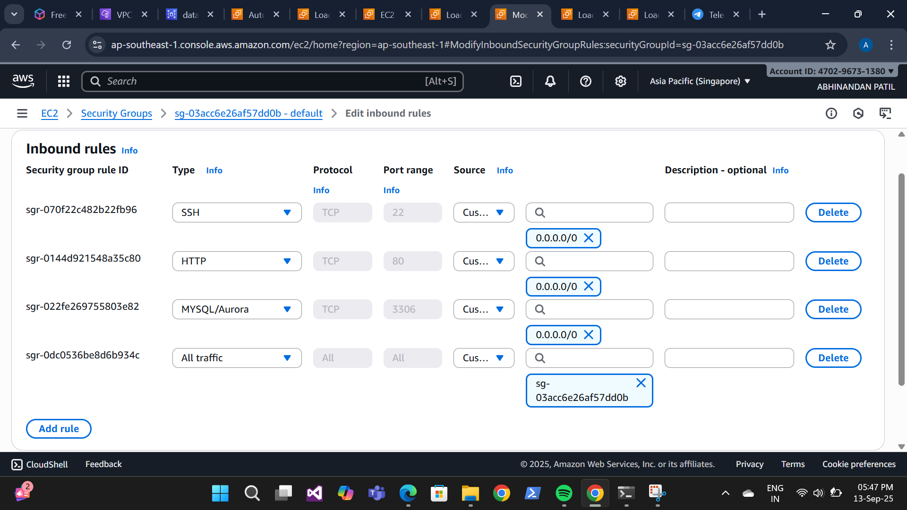
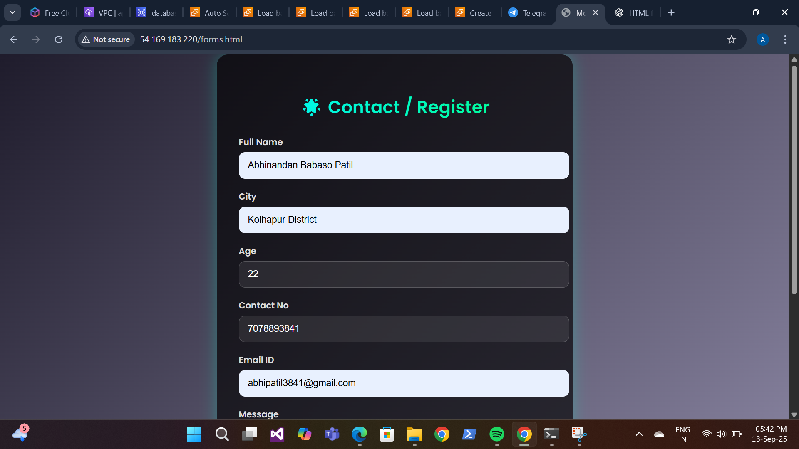
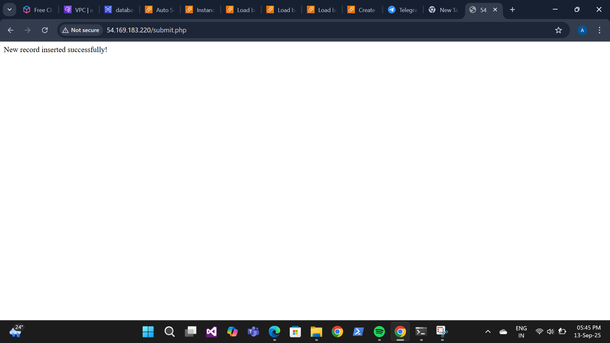
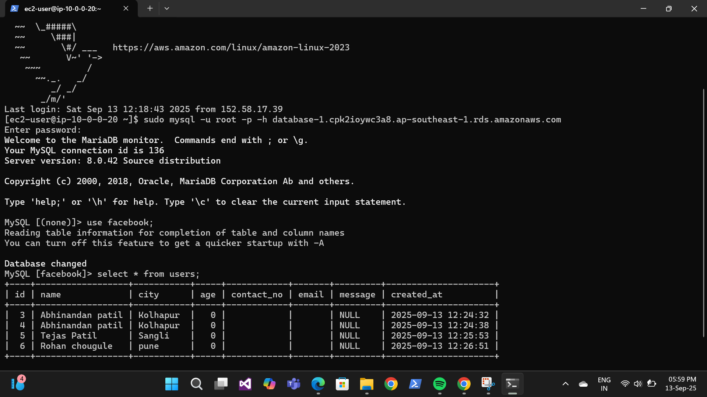

> ✨ Just completed my 3-Tier Architecture Project with Load Balancer on
>
> This project demonstrates a **Three-Tier** **Architecture** (Web → App
> → Database) deployed on the **cloud** with a **Load** **Balancer** for
> high availability and scalability.
>
> I designed and deployed a scalable, secure, and highly available cloud
> infrastructure using:
>
> Web Tier (EC2 Instances)-Handles user requests
>
> Application Tier (EC2 Instances)-Runs business logic on multiple
> servers
>
> Database Tier (RDS)-Stores data securely
>
> Elastic Load Balancer (ELB)-Distributes HTTP/HTTPS traffic.
>
> VPC & Security Groups- Network and security setup.
>
> ⚙ Step-by-Step Deployment
>
> 1 \] Setup Networking
>
> 2\]Create an Elastic Load Balancer (ALB).
>
> 3\]Launch an Auto Scaling Group of EC2 instances.
>
> 4\]Connect the app to the Database Tier securely.
>
> 5\]Launch Amazon RDS
>
> 6\]Copy the DNS name of ALB
>
> 7\]Paste into browser
>
> 8\]Refresh → Requests will be shared across multiple servers.
>
> This project shows how to deploy a Web Tier, Application Tier, and
> Database Tier in the cloud with an Elastic Load Balancer.
>
> \#CloudComputing \#AWS \#LoadBalancer \#3TierArchitecture
> \#LearningByDoing#ravindra bagale
>
> 1 / 4

readme.md 2025-09-14

> 2 / 4

readme.md 2025-09-14

> 3 / 4

readme.md 2025-09-14

> 4 / 4
